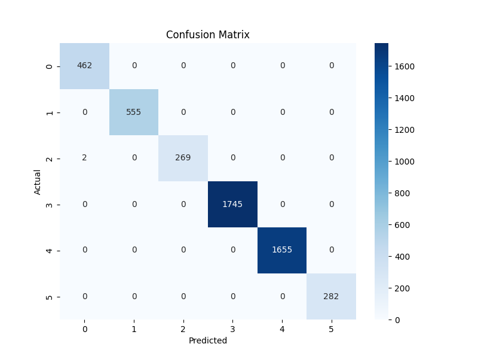
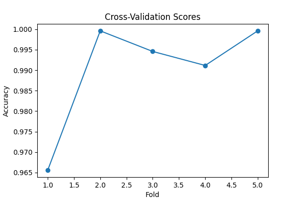
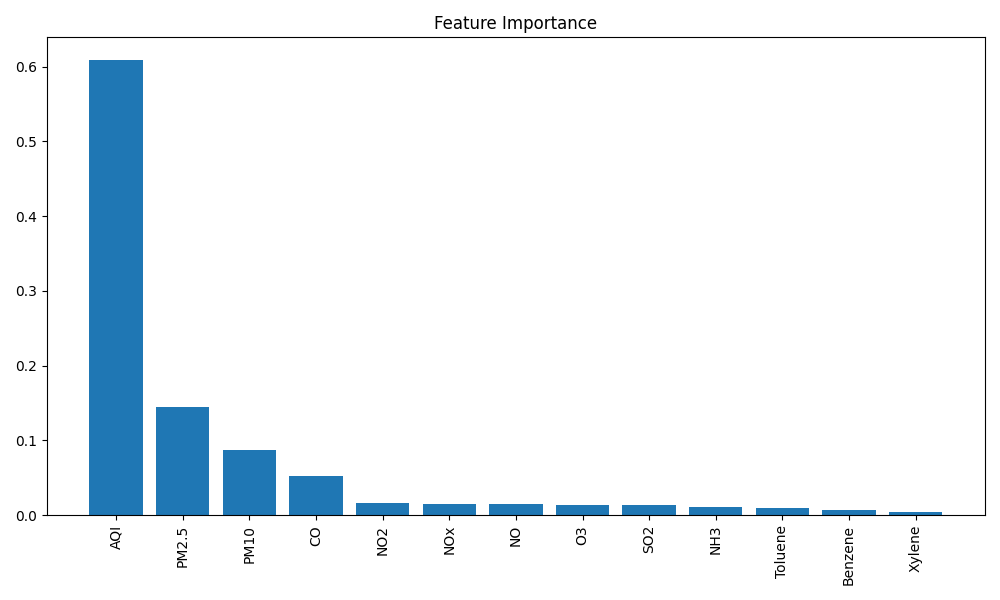

# AQI Prediction Project

This project uses Random Forest to predict AQI value based on a cleaned dataset, and it visualizes the predictions and model performance with various graphs.

## Files Overview

### 1. `cleaning.py`
- **Description**: Cleans the raw dataset by handling missing values and unnecessary columns. After processing, it generates the file `cleaned_data.csv`.

### 2. `cleaned_data.csv`
- **Description**: The cleaned dataset generated by `cleaning.py`, which serves as the input for training the Random Forest model.

### 3. `train.py`
- **Description**: Trains a Random Forest Classifier on the cleaned dataset.
  - **Features**: Uses the dataset without `AQI_Bucket`, `City`, and `Date` columns to predict the target `AQI_Bucket`.
  - **Result**: Achieved approximately 99% accuracy.

### 4. `graph.py`
- **Description**: Generates the following graphs to assess the model performance:
  - Confusion Matrix: Compares the predicted vs actual AQI bucket classes. Correct predictions are shown on the diagonal, while misclassifications 
    are off-diagonal.
  - Cross Validation: Displays the model's average performance across multiple validation splits, ensuring that it generalizes well to unseen data.
  - Feature Importance:  Shows the importance of each feature in predicting AQI buckets, highlighting which factors influence the predictions the 
    most.
  
  ### Graphs:
  - **Confusion Matrix**  
    

  - **Cross Validation Results**  
    

  - **Feature Importance**  
    

### 5. `prediction_graph.py`
- **Description**: This script predicts AQI values for specific cities (e.g., Ahmedabad and Delhi) in 2030 using the trained model.
  
  ### Prediction Graphs:
  - **Ahmedabad 2030 AQI Prediction**  
    
  
  - **Delhi 2030 AQI Prediction**  
    

