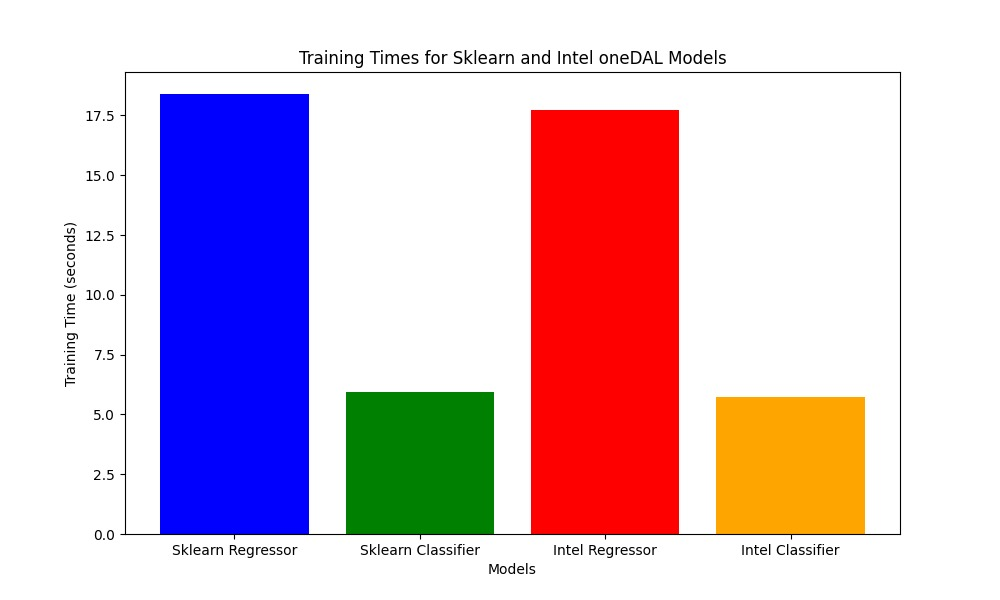

# AQ-drone Project: Air Quality Prediction System

This repository contains various scripts designed to preprocess, analyze, and predict air quality metrics using drone and sensor data. The workflow integrates Bluetooth-based data retrieval, data cleaning, AQI calculation, and model training/prediction using Random Forest models, both with scikit-learn and Intel OneDAL optimizations.

### Files and Descriptions

1. **preprocess.py**  
   - **Description:** This script processes the "City_hour.csv" file by performing data preprocessing tasks such as column selection and removal of null values. The final cleaned output is saved as "cleaned_data.csv."
   - **Output:** `cleaned_data.csv`

2. **bluetooth_data.py**  
   - **Description:** Handles incoming sensor data received from drones and other devices via Bluetooth. It processes the raw data and prepares it for further AQI computations.
   - **Input:** `received_data_from_bluetooth`
   - **Output:** Intermediate processed data for AQI calculations.

3. **airq_processing.py**  
   - **Description:** This script takes the data preprocessed by `bluetooth_data.py` and computes AQI values based on gas readings (e.g., NH3, CO2, VOC). It outputs a file "Data_with_AQI.csv," containing air quality data with AQI values.
   - **Input:** Data from `bluetooth_data.py`
   - **Output:** `Data_with_AQI.csv`

4. **Train-test.py**  
   - **Description:** This script performs model training and testing for AQI prediction using Random Forest Classifier and Regression models. It leverages both scikit-learn and Intel OneDAL libraries. The script predicts the AQI for the next 24 hours using the most recent AQI data from "Data_with_AQI.csv." Additionally, it provides a runtime comparison between scikit-learn and Intel models and generates visualizations of the results.
   - **Input:** `Data_with_AQI.csv`
   - **Output:** Predictions for the next 24 hours, runtime summaries, and performance graphs.

### Training Graph

Below is the graph showing the training performance of the models. 

